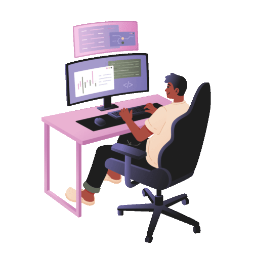

   

<h1 align="center">
  
    </h1>
<h3 align="center"> Backend Developer 👨‍💻| Software Engineer 🌐🛠️ </h3>

    

 <h3> Who Am I 🕵️‍♂️ ? </h3>

**`Hi, I’m Odeesha Oshan, a Software Engineering undergraduate currently pursuing a BSc (Hons) in Software Engineering at SLTC Research University in Sri Lanka. I’m currently in my third year, with a strong interest in backend development, artificial intelligence, and building reliable software systems.

Throughout my studies and personal projects, I have developed a solid understanding of software engineering fundamentals, including Object-Oriented Programming, software architecture, databases, REST APIs, software quality assurance, virtualization, containerization, and Git-based development workflows. I enjoy understanding how systems work internally and applying these concepts to build practical and maintainable applications.

I have worked with technologies including Java, Spring Boot, React, TypeScript, Python, MySQL, Docker, and Git. Through university projects and independent development, I have gained experience working across both backend and frontend components, designing RESTful APIs, integrating databases, implementing authentication, and developing modular software systems.

One of my major projects is AgriSense AI, a farm management platform designed to help manage areas such as farmers, crops, inventory, weather information, and agricultural operations. Working on this project has given me practical experience with Spring Boot, MySQL, React, API integration, authentication, Docker, and software quality practices.

I am also increasingly interested in Artificial Intelligence and AI-powered software development. My goal is to combine strong software engineering fundamentals with AI technologies to build useful, scalable, and reliable applications rather than treating AI as an isolated technology.

I continuously challenge myself to learn new technologies, improve my problem-solving abilities, and understand the engineering principles behind the systems I build. My long-term goal is to grow into a strong software engineer and AI-focused developer capable of designing, building, and maintaining real-world software systems.

`**

- 🌱 I’m currently learning **React and Springboot Development**

- 📫 How to reach me **odishaoshan6@gmail.com**

- ⚡ Fun fact **Always Want To Learn More 📚 .**

<h3 align="left">let's get in touch :</h3>

<!-- <h3 align="left">My Resume : </h3> -->

<h3 align="center" > 🚀 Languages - Frameworks - Tools - Libraries - Workspace 🚀</h3>

    

<h3 align="center">📊 GitHub Stats 📊</h3>

    
    

